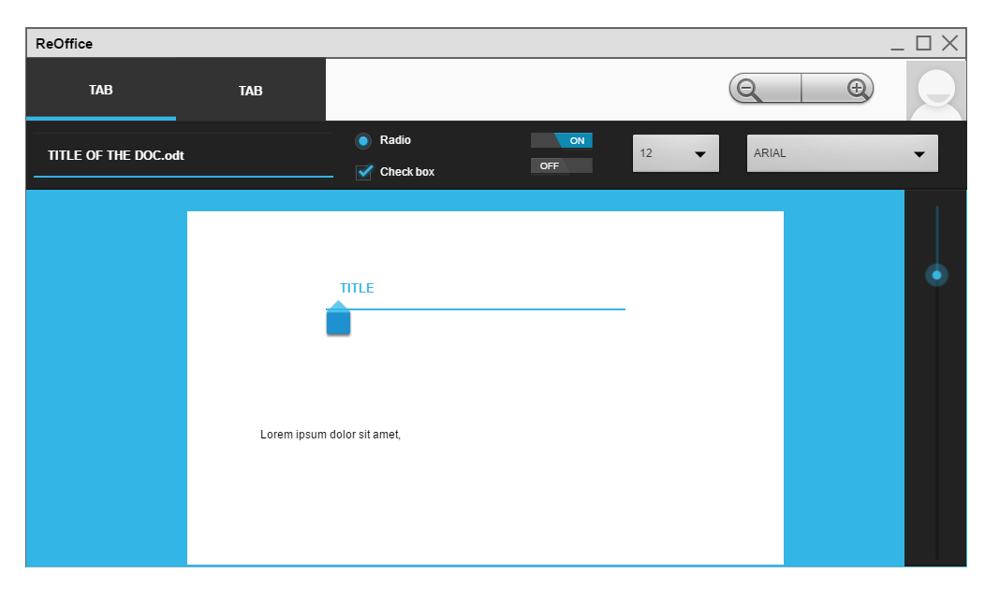

# ReOffice
Office Suit, for RedoxOS.

##Goals

- 64 Bit
- Minimal & Clean
- Design UI also clean & minimal, like ModernUI (Microsoft, in mind!)

## UI Design Design Study

- clean
- Tabbed Menu
- Zoom In/Out menu for the Document
- no Sidebar/s Menu
- If you typed the name of the document, it popsup a message where u wanna save it!
- *.ODT is the supported document mainfile
- Microphone is supported for the integrated Speech to Text software support (represents the on button)
- The off button, is the supported Text to Speech software

this is not finished or in progress, just to present the look and feel!
it is made with Pencil Software
https://pencil.evolus.vn/
